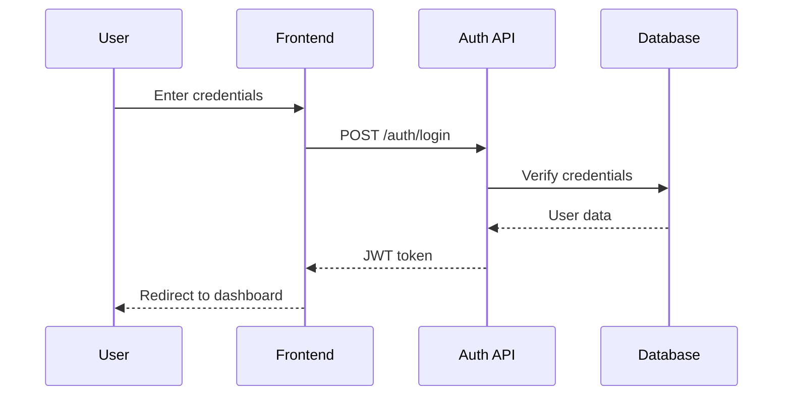
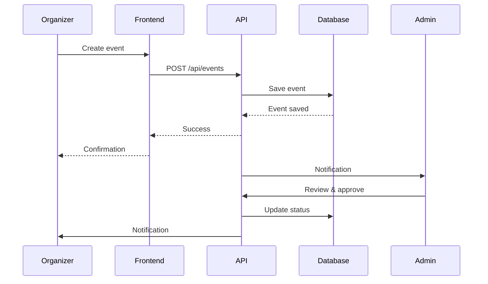
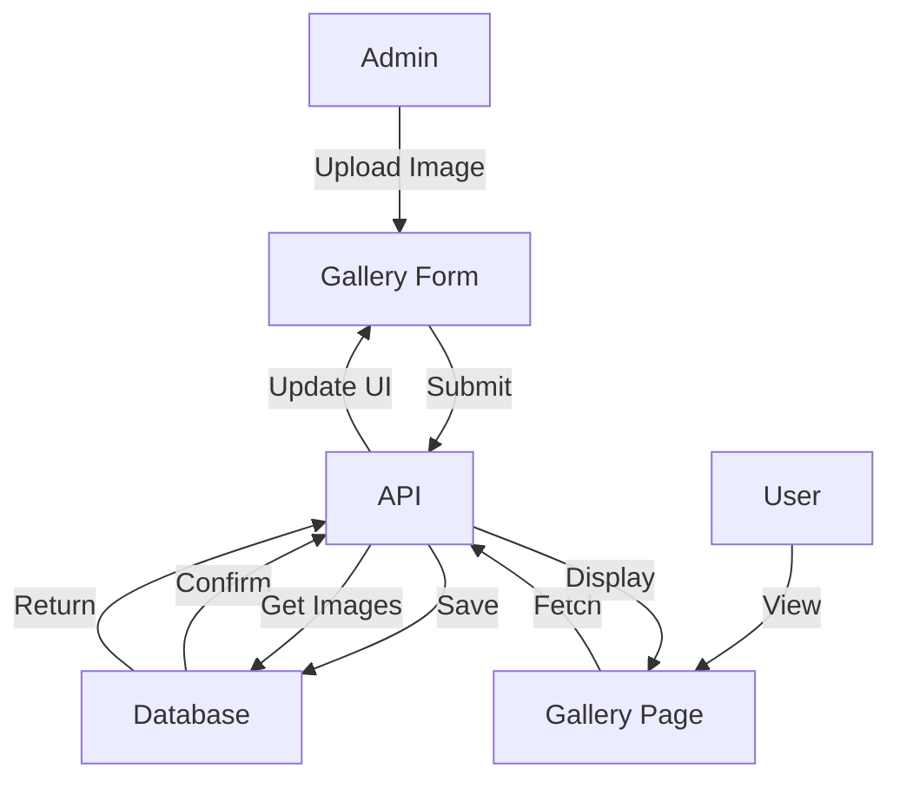
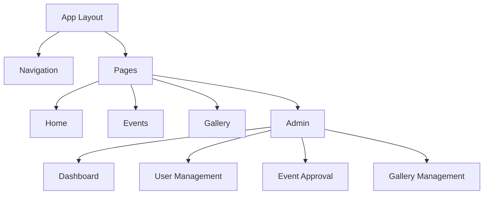
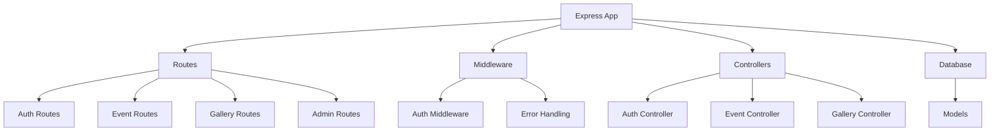
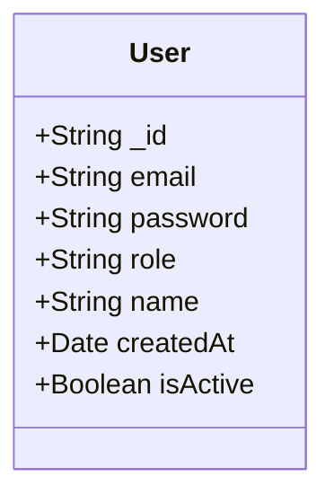
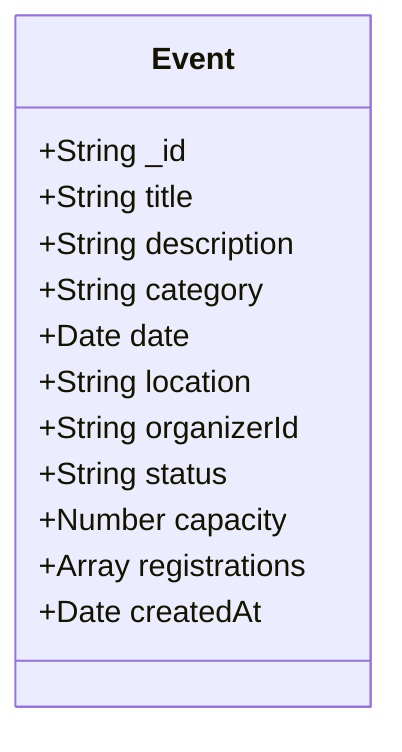
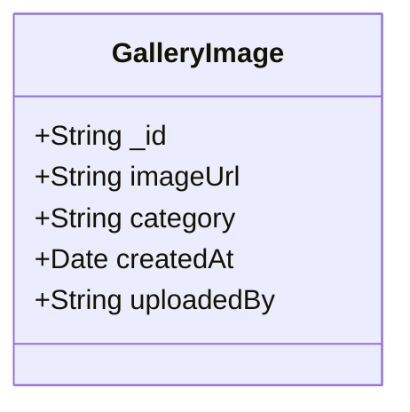
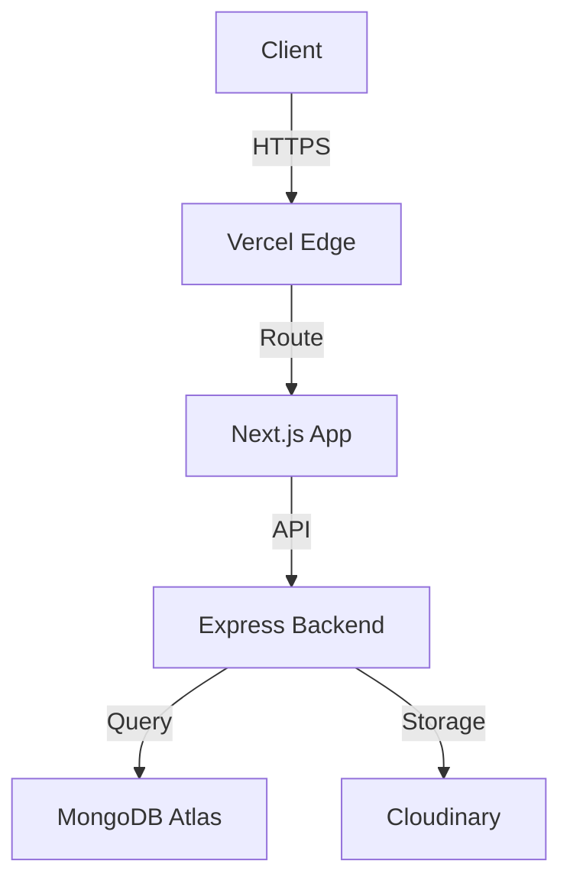

# System Architecture

## System Flow Diagrams

### Authentication Flow

### Event Creation Flow

### Gallery Management Flow

## Component Architecture

### Frontend Components

### Backend Architecture

## Database Schema

### Users Collection

### Events Collection

### Gallery Collection

## Network Architecture
